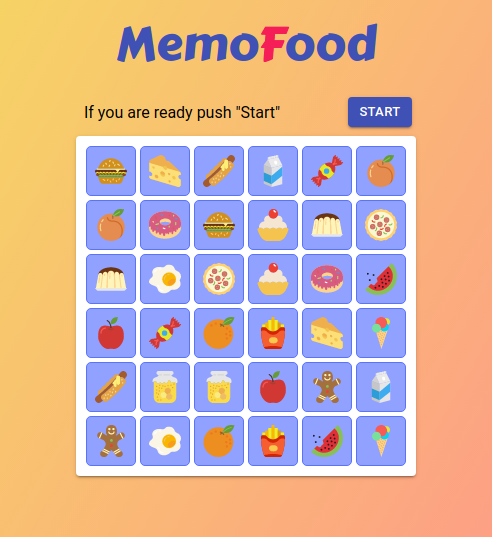

## MemoFood Game

<p align="center">
  
</p>

<p align="center">
  <a href="https://deylenergy.github.io/memo-food/" target="_blank">View demo</a>
</p>

### Description

Train your memory by remembering the positions of food cards.

- Cards positioned randomly
- There are 18 pairs of food cards
- 5 seconds to recall a pair card
- Your player will be put in _Stats_ based on points and time
- Multiple profiles to compete with your friends!

UI logic controlled by XState.

### Built With

- [TypeScript](https://www.typescriptlang.org/)
- [React](https://reactjs.org/)
- [XState](https://xstate.js.org/)
- [Material UI](https://material-ui.com/)

## State machine

[![GameMachine][game_machine]]()

### Installation

1. Clone the repo
   ```sh
   git clone https://github.com/DeylEnergy/memo-food.git
   ```
2. Open folder
   ```sh
   cd memo-food
   ```
3. Install NPM packages
   ```sh
   npm install
   ```
4. Start developer server
   ```sh
   npm start
   ```

[game_machine]: assets/game_machine.png
